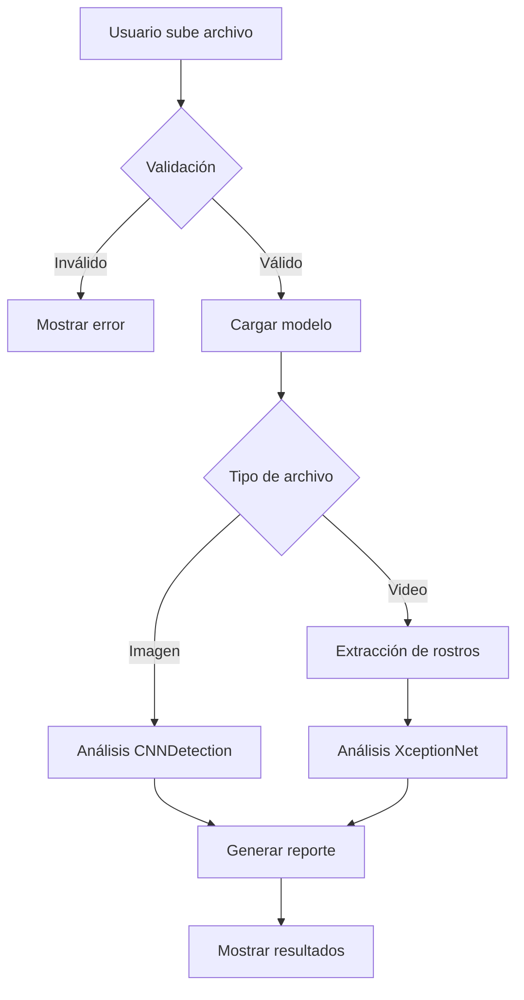

# 🕵️‍♀️ UIDE Forense AI

<div align="center">


**Sistema Avanzado de Detección de Deepfakes y Contenido Sintético**

Plataforma basada en Inteligencia Artificial para análisis forense de medios digitales

[Características](#-características) • [Instalación](#-instalación) • [Uso](#-uso) • [Arquitectura](#-arquitectura-técnica) • [Equipo](#-equipo-de-desarrollo)

</div>

---

## 📋 Tabla de Contenidos

- [Características](#-características)
- [Requisitos](#-requisitos-del-sistema)
- [Instalación](#-instalación)
- [Uso](#-uso)
- [Arquitectura Técnica](#-arquitectura-técnica)
- [Modelos de IA](#-modelos-de-ia)
- [Limitaciones](#-limitaciones-conocidas)
- [Consideraciones Éticas](#️-consideraciones-éticas)
- [Equipo de Desarrollo](#-equipo-de-desarrollo)
- [Referencias](#-referencias-académicas)
- [Licencia](#-licencia)

---

## ✨ Características

### 🖼️ Detección de Imágenes Sintéticas
- ✅ Identifica imágenes generadas por IA (DALL-E, Midjourney, Stable Diffusion)
- ✅ Detecta manipulaciones con Photoshop y herramientas de edición
- ✅ Analiza artefactos de GANs y modelos de difusión
- ✅ Reportes visuales detallados con métricas de confianza

### 🎥 Detección de Deepfakes en Video
- ✅ Análisis frame-por-frame de rostros
- ✅ Detecta Face Swap, síntesis facial y reenactment
- ✅ Procesamiento optimizado con muestreo inteligente
- ✅ Barra de progreso en tiempo real

### 🎨 Interfaz Profesional
- ✅ Diseño moderno con animaciones suaves
- ✅ Reportes interactivos con gráficos circulares
- ✅ Responsive y optimizado para diferentes dispositivos
- ✅ Validación de entrada y manejo robusto de errores

---

## 💻 Requisitos del Sistema

### Hardware
- **RAM**: Mínimo 8GB (Recomendado: 16GB)
- **CPU**: Procesador multi-core moderno
- **GPU**: Opcional (CUDA compatible para mejor rendimiento)
- **Almacenamiento**: 500MB para modelos + espacio para archivos

### Software
- **Python**: 3.8 o superior
- **Sistema Operativo**: Windows 10/11, Linux, macOS
- **Navegador**: Chrome, Firefox, Safari o Edge (versiones recientes)

---

## 🚀 Instalación

### 1. Clonar el Repositorio
```bash
git clone https://github.com/T0NY24/ProyectoForenseUIDE.git
cd ProyectoForenseUIDE
```

### 2. Crear Entorno Virtual (Recomendado)
```bash
# Windows
python -m venv venv
venv\Scripts\activate

# Linux/macOS
python3 -m venv venv
source venv/bin/activate
```

### 3. Instalar Dependencias
```bash
pip install -r requirements.txt
```

### 4. Descargar Modelos

El modelo de imágenes debe estar en `weights/blur_jpg_prob0.1.pth`. Si no lo tienes:

```bash
# Opción 1: Descargar manualmente desde el repositorio del modelo
# https://github.com/PeterWang512/CNNDetection

# Opción 2: Usar el script incluido (si aplica)
python scripts/download_ff.py
```

**Nota**: El modelo de video (XceptionNet) se descarga automáticamente al ejecutar la aplicación por primera vez.

---

## 🎯 Uso

### Iniciar la Aplicación

```bash
python app.py
```

La aplicación se abrirá en tu navegador en `http://localhost:7860`

### Análisis de Imágenes

1. Ve a la pestaña **"🖼️ Análisis de Imágenes"**
2. Sube una imagen (JPG, PNG, WebP, BMP)
3. Haz clic en **"🔍 Iniciar Análisis Forense"**
4. Revisa el reporte detallado con:
   - Clasificación (Real/Fake)
   - Nivel de confianza
   - Métricas técnicas
   - Detalles del modelo

### Análisis de Videos

1. Ve a la pestaña **"🎥 Análisis de Videos"**
2. Sube un video (MP4, AVI, MOV, MKV, WebM)
   - Máximo: 200MB
   - Duración máxima: 5 minutos
3. Haz clic en **"▶️ Analizar Deepfakes"**
4. Espera el análisis (muestra barra de progreso)
5. Revisa el reporte con:
   - Clasificación (Real/Deepfake)
   - Número de rostros detectados
   - Frames analizados
   - Tiempo de procesamiento

### Configuración Avanzada

Edita `config.py` para personalizar:

```python
# Límites de archivos
MAX_IMAGE_SIZE_MB = 15
MAX_VIDEO_SIZE_MB = 200
MAX_VIDEO_DURATION_SECONDS = 300

# Umbrales de detección
IMAGE_THRESHOLD = 50.0
VIDEO_THRESHOLD = 50.0

# Optimización de video
VIDEO_FRAME_STRIDE = 30  # Analizar 1 frame cada N
```

---

## 🏗️ Arquitectura Técnica

### Estructura del Proyecto

```
ProyectoForenseUIDE/
├── app.py              # Aplicación principal con UI
├── config.py           # Configuración centralizada
├── utils.py            # Funciones de utilidad
├── requirements.txt    # Dependencias Python
├── README.md          # Documentación
│
├── weights/           # Modelos pre-entrenados
│   └── blur_jpg_prob0.1.pth
│
├── scripts/           # Scripts auxiliares
│   └── download_ff.py
│
└── samples/           # Archivos de ejemplo (opcional)
```

### Flujo de Procesamiento



### Componentes Clave

#### 1. `ModelManager` (app.py)
Gestiona la carga y caché de modelos:
- Carga perezosa de modelos
- Manejo de errores robusto
- Soporte para CPU/GPU

#### 2. Sistema de Validación (utils.py)
Valida archivos antes del procesamiento:
- Tamaño y formato
- Dimensiones de imagen
- Duración de video

#### 3. Generación de Reportes (utils.py)
Crea reportes HTML interactivos:
- Medidores circulares SVG
- Barras de progreso animadas
- Cards de estadísticas
- Diseño responsive

---

## 🧠 Modelos de IA

### Modelo de Imágenes: CNNDetection (ResNet50)

**Descripción**: Red neuronal convolucional entrenada para detectar artefactos de generación sintética.

**Características**:
- Arquitectura: ResNet50 con capa fully-connected personalizada
- Entrada: Imágenes RGB de 224x224 píxeles
- Salida: Probabilidad de ser sintética (0-100%)
- Dataset: CNN-generated images (20 generadores diferentes)

**Detecciones**:
- StyleGAN, StyleGAN2, StyleGAN3
- ProGAN, BigGAN
- CycleGAN, StarGAN
- DALL-E, Midjourney, Stable Diffusion

**Referencia**: [Wang et al., CVPR 2020](https://github.com/PeterWang512/CNNDetection)

### Modelo de Video: XceptionNet

**Descripción**: Arquitectura especializada en detección de deepfakes en video.

**Características**:
- Arquitectura: Xception con depthwise separable convolutions
- Entrada: Rostros extraídos de 299x299 píxeles
- Salida: Real/Fake binario con probabilidad
- Dataset: FaceForensics++ (4 métodos de manipulación)

**Detecciones**:
- Face2Face (reenactment)
- FaceSwap
- DeepFakes
- NeuralTextures

**Referencia**: [Chollet, CVPR 2017](https://arxiv.org/abs/1610.02357)

---

## ⚠️ Limitaciones Conocidas

### Técnicas
1. **Falsos Positivos**: Imágenes reales de alta calidad pueden ser marcadas como sintéticas
2. **Generadores Nuevos**: Modelos no vistos durante el entrenamiento pueden no detectarse
3. **Post-Procesamiento**: Compresión o filtros pueden afectar la detección
4. **Calidad de Video**: Videos de baja resolución reducen la precisión

### Operacionales
1. **Procesamiento de CPU**: Videos largos pueden tardar varios minutos
2. **Requisito de Rostros**: El análisis de video requiere rostros visibles
3. **Sin GPU**: El rendimiento es limitado sin aceleración por hardware

### Éticas
1. **No es evidencia legal**: Los resultados son probabilísticos
2. **Requiere verificación**: Un experto debe validar los hallazgos
3. **Sesgos del modelo**: Posibles sesgos en datos de entrenamiento

---

## ⚖️ Consideraciones Éticas

> **⚠️ USO ACADÉMICO Y DE INVESTIGACIÓN**

Esta herramienta fue desarrollada exclusivamente con fines académicos y de investigación en el campo de la visión por computadora y la inteligencia artificial.

### Uso Responsable

✅ **Uso apropiado**:
- Investigación académica sobre medios sintéticos
- Educación en alfabetización mediática
- Desarrollo de contra-medidas tecnológicas
- Verificación de contenido con consentimiento

❌ **Uso inapropiado**:
- Vigilancia sin consentimiento
- Difamación o acoso
- Evidencia legal única sin validación experta
- Violación de privacidad

### Privacidad

- Los archivos procesados **NO** se almacenan en servidores
- Todo el procesamiento ocurre **localmente**
- No se recopilan datos del usuario
- No se envía información a terceros

### Precisión

Los resultados son **probabilísticos** y sujetos a:
- Limitaciones del modelo
- Calidad del archivo de entrada
- Técnicas de manipulación utilizadas

**Siempre consulte a un experto forense para casos críticos.**

---

## 👥 Equipo de Desarrollo

Este proyecto fue desarrollado por estudiantes de la **Universidad Internacional del Ecuador (UIDE)**:

| Miembro | Rol |
|---------|-----|
| **Anthony Perez** | Investigador Principal & ML Engineer |
| **Bruno Ortega** | Desarrollador de Modelos |
| **Manuel Pacheco** | Ingeniero de Software & UI/UX |

### Institución

**Universidad Internacional del Ecuador (UIDE)**  
Facultad de Ingeniería  
Programa de Ciencias de la Computación

---

## 📚 Referencias Académicas

1. **Wang, S. Y., et al.** (2020). "CNN-generated images are surprisingly easy to spot... for now." 
   *Proceedings of the IEEE/CVF Conference on Computer Vision and Pattern Recognition (CVPR)*.
   - [Paper](https://arxiv.org/abs/1912.11035) | [Code](https://github.com/PeterWang512/CNNDetection)

2. **Chollet, F.** (2017). "Xception: Deep Learning with Depthwise Separable Convolutions." 
   *Proceedings of the IEEE Conference on Computer Vision and Pattern Recognition (CVPR)*.
   - [Paper](https://arxiv.org/abs/1610.02357)

3. **Rössler, A., et al.** (2019). "FaceForensics++: Learning to Detect Manipulated Facial Images." 
   *Proceedings of the IEEE/CVF International Conference on Computer Vision (ICCV)*.
   - [Paper](https://arxiv.org/abs/1901.08971) | [Dataset](https://github.com/ondyari/FaceForensics)

4. **Tolosana, R., et al.** (2020). "DeepFakes and Beyond: A Survey of Face Manipulation and Fake Detection." 
   *Information Fusion*.
   - [Paper](https://arxiv.org/abs/2001.00179)

---

## 📄 Licencia

Este proyecto es de uso **académico y educativo**. El código se proporciona "tal cual" sin garantías.

### Modelos de Terceros

Los modelos utilizados están sujetos a sus respectivas licencias:
- **CNNDetection**: Licencia del proyecto original
- **XceptionNet**: Apache 2.0 (via timm)

Por favor, consulta las licencias originales antes de usar en producción.

---

## 🤝 Contribuciones

Este es un proyecto académico. Para sugerencias o mejoras:

1. Abre un **Issue** en GitHub
2. Describe el problema o mejora propuesta
3. Espera feedback del equipo

---

## 📞 Contacto

Para consultas académicas o colaboraciones:

- **Email institucional**: [Contacto UIDE]
- **GitHub**: [T0NY24/ProyectoForenseUIDE](https://github.com/T0NY24/ProyectoForenseUIDE)

---

<div align="center">

**Hecho con ❤️ por estudiantes de UIDE**

© 2025 Universidad Internacional del Ecuador - Todos los derechos reservados

</div>
